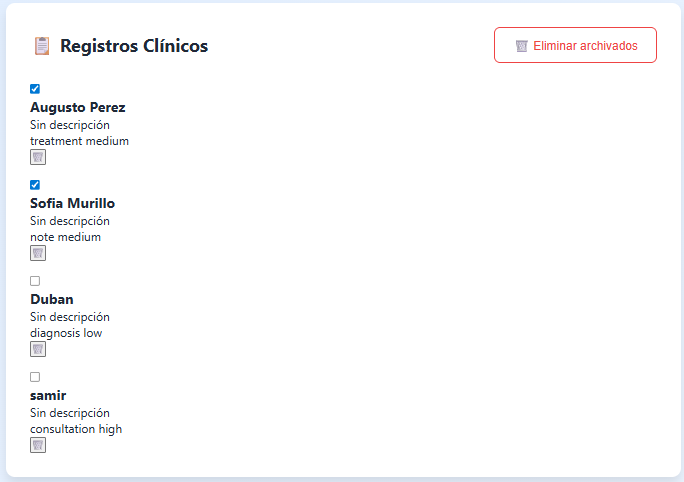

# Ficha de Sistema de Historia Clínica Electrónica - Juan Esteban

## 📋 Información
- **Nombre**: Juan Esteban  
- **Fecha**: 10/02/2026  
- **Dominio Asignado**: Sistema de Historia Clínica Electrónica (EHR)  
- **Entidad Principal**: Sistema web para la gestión de registros clínicos de pacientes  

---

## 🎯 Descripción
Aplicación web que simula un **Sistema de Historia Clínica Electrónica (EHR)**, permitiendo registrar, visualizar, archivar y gestionar información clínica de forma local mediante el navegador.

El sistema incluye manejo de registros, control de estados (activo / archivado), eliminación de datos, filtros de búsqueda y **estadísticas del sistema**, representando el funcionamiento básico de una plataforma clínica digital.

---

## 📚 Conceptos ES2023 Aplicados
- [x] Variables con `let` y `const`  
- [x] Funciones flecha (Arrow Functions)  
- [x] Template literals  
- [x] Manipulación del DOM  
- [x] Métodos de arrays (`map`, `filter`, `forEach`)  
- [x] LocalStorage  
- [x] Eventos (`addEventListener`)  

---

## 🚀 Cómo Ejecutar
1. Descargar o clonar el proyecto  
2. Abrir el archivo `index.html` en el navegador  
3. Registrar información clínica desde el formulario  
4. Usar filtros, búsqueda y botones de gestión  

> No requiere servidor ni base de datos externa.

---

## 📸 Screenshots
- Vista general del sistema  

- Registros activos y archivados  

- Estadísticas del sistema  

---

## 📊 Estadísticas del Sistema
El sistema muestra estadísticas calculadas automáticamente:
- Total de registros clínicos
- Registros activos
- Registros archivados
- Distribución por categoría
- Distribución por prioridad

Las estadísticas se actualizan en tiempo real según las acciones del usuario.

---

## 🎯 Autoevaluación
- Funcionalidad: 95%  
- Uso de JavaScript moderno: 100%  
- Código limpio y estructurado: 95%  
- Adaptación al dominio EHR: 100%  
- **Total Estimado**: 97%  