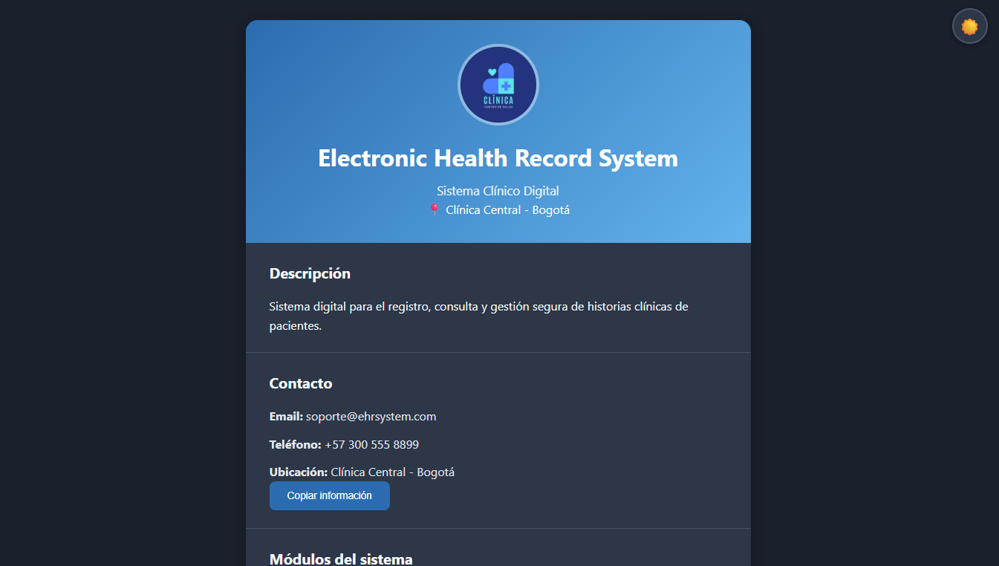
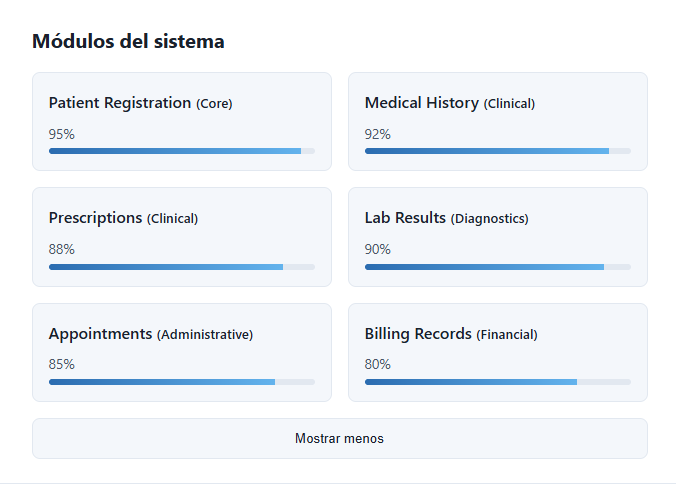

# Ficha de Sistema de Historia Clínica Electrónica - Juan Esteban

## 📋 Información
- **Nombre**: Juan Esteban  
- **Fecha**: 10/02/2026  
- **Dominio Asignado**: Sistema de Historia Clínica Electrónica (EHR)  
- **Entidad Principal**: Plataforma digital para la gestión de historias clínicas y módulos clínicos  

## 🎯 Descripción
Ficha interactiva que representa un Sistema de Historia Clínica Electrónica (EHR), mostrando información general del sistema, módulos funcionales con niveles de implementación, estadísticas operativas y opciones de interacción como cambio de tema, visualización progresiva de módulos y copia de información al portapapeles.

## 📚 Conceptos ES2023 Aplicados
- [x] Variables con let/const  
- [x] Template literals  
- [x] Arrow functions  
- [x] Destructuring  
- [x] Optional chaining (?.)  
- [x] Nullish coalescing (??)  

## 🚀 Cómo Ejecutar
1. Abrir el archivo `index.html` en el navegador  

## 📸 Screenshots
- Vista general del sistema 

- Modo oscuro activado 
 
- Módulos del sistema desplegados 

## 🎯 Autoevaluación
- Funcionalidad: 95%  
- Código ES2023: 100%  
- Código Limpio: 95%  
- Adaptación al Dominio: 100%  
- **Total Estimado**: 97%

